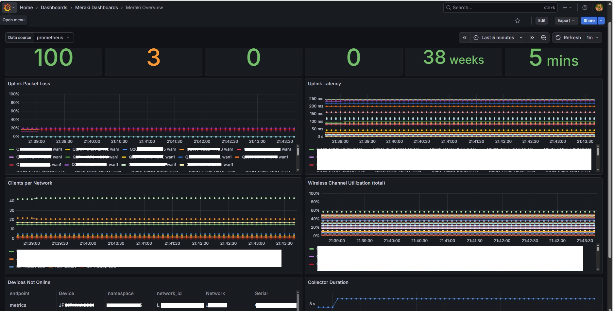
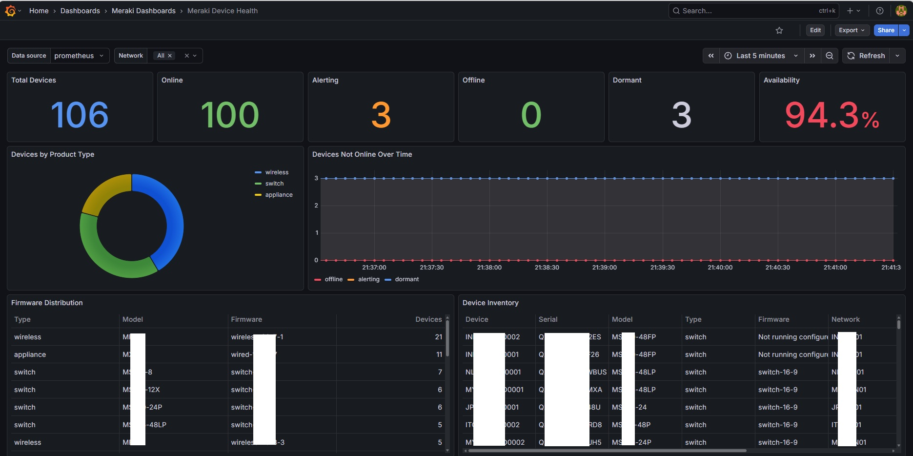
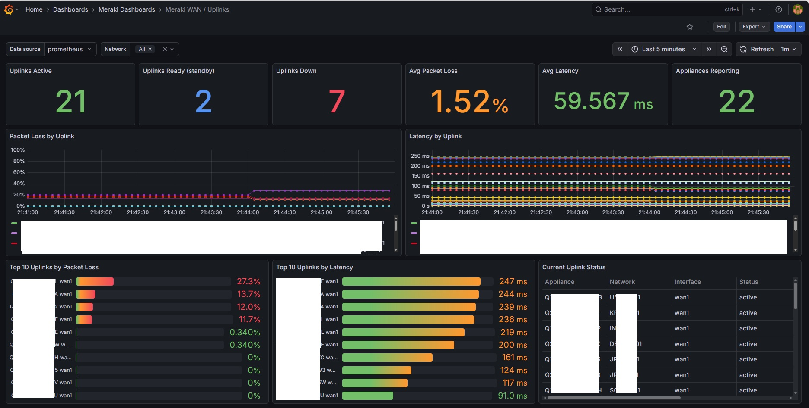
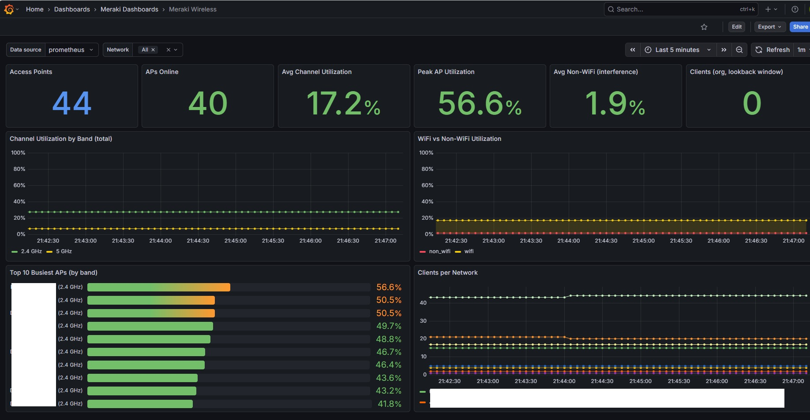

# meraki-exporter

Prometheus exporter for Cisco Meraki Dashboard API (v1) metrics. Written in Go, designed for a single organization, deployed as a systemd service on Linux.

## How it works

The Meraki API is slow and rate-limited (10 requests/second per org), so this exporter does not call the API at scrape time. Background pollers refresh data and cache the results; `GET /metrics` serves the cache instantly. The client keeps itself at ~5 req/s, honors `Retry-After` on HTTP 429, retries transient failures with exponential backoff, and follows `Link`-header pagination.

Collectors are split into two poll groups so slow-changing data doesn't waste API budget: the **fast group** (default: `devices`, `uplinks`, `wireless`, plus any enabled opt-ins not marked slow) refreshes every `--scrape.interval` (default 120s); the **slow group** (default: `clients`, `licenses`, `apiusage`, `alerts`) every `--scrape.slow-interval` (default 15m). Group membership is configurable via `COLLECTORS_SLOW`. Each group has its own metrics endpoint (see Endpoints below), and `/metrics` serves both combined.

## Repository layout

```
cmd/meraki-exporter/        main entry point
internal/config/            flag/env configuration
internal/meraki/            Meraki Dashboard API client and types
internal/collector/         poller, metric descriptors, per-domain collectors
deploy/                     systemd unit, env file example, web-config example
prometheus/                 alerting rules and scrape config example
grafana/                    importable dashboards
```

## Collectors

| Collector  | Metrics | Meraki endpoints |
|------------|---------|------------------|
| `devices`  | `meraki_device_info`, `meraki_device_status` | `/organizations/{org}/devices`, `/devices/availabilities` |
| `uplinks`  | `meraki_uplink_status`, `meraki_uplink_loss_percent`, `meraki_uplink_latency_seconds`, `meraki_appliance_ha_enabled`/`_role` (warm spare) | `/appliance/uplink/statuses`, `/devices/uplinksLossAndLatency` |
| `clients`  | `meraki_org_clients`, `meraki_network_clients`, `meraki_network_clients_heavy_usage` | `/clients/overview`, `/networks/{id}/clients/overview` |
| `wireless` | `meraki_wireless_channel_utilization_percent` | `/wireless/devices/channelUtilization/byDevice` |
| `licenses` | `meraki_license_status_ok`, `meraki_license_expiration_timestamp_seconds`, `meraki_licensed_devices` | `/licenses/overview` |
| `apiusage` | `meraki_org_api_response_codes` | `/apiRequests/overview` |
| `vpn`* | `meraki_vpn_peer_status` | `/appliance/vpn/statuses` |
| `switchports`* | `meraki_switch_port_status`, `_enabled`, `_poe_allocated` | `/switch/ports/statuses/bySwitch` |
| `sensors`* | `meraki_sensor_*` (temperature, humidity, door, water, co2, tvoc, noise, battery) | `/sensor/readings/latest` |
| `alerts`* | `meraki_org_open_alerts` | `/assurance/alerts` |

\* opt-in — not enabled by default; add to `COLLECTORS_ENABLED`.

Status metrics (`meraki_device_status`, `meraki_uplink_status`) are emitted as state sets: one series per known state with value 1 for the current state and 0 otherwise, so absence never masks an outage.

The exporter also exposes meta-metrics: `meraki_exporter_api_requests_total{code}` (this exporter's own API calls), `meraki_exporter_collector_success{collector}`, `meraki_exporter_collector_duration_seconds{collector}`, and `meraki_exporter_last_poll_timestamp_seconds`.

Notes: `uplinks` loss/latency covers MX/MG WAN uplinks that Meraki probes; `wireless` requires MR access points; `licenses` expiration applies to co-termination licensing orgs. Collectors that don't apply to your hardware can be disabled via `COLLECTORS_ENABLED`.

## Get the binary

### Option A: download a release binary

Prebuilt static binaries for `linux/amd64`, `linux/arm64`, `darwin/amd64`, and `darwin/arm64` are attached to each [GitHub Release](https://github.com/machani/meraki-exporter/releases), along with a `.sha256` checksum:

```sh
curl -LO https://github.com/machani/meraki-exporter/releases/latest/download/meraki-exporter-linux-amd64
curl -LO https://github.com/machani/meraki-exporter/releases/latest/download/meraki-exporter-linux-amd64.sha256
sha256sum -c meraki-exporter-linux-amd64.sha256
chmod +x meraki-exporter-linux-amd64
```

### Option B: build from source

Requires Go 1.25+ to satisfy the `go` directive; `go.mod` also pins `toolchain go1.26.5`, so any Go ≥ 1.21 will download and use the right toolchain automatically.

```sh
go mod tidy
CGO_ENABLED=0 go build -trimpath -ldflags='-s -w' -o meraki-exporter ./cmd/meraki-exporter
```

Cross-compile from another machine for the Linux box: `GOOS=linux GOARCH=amd64 CGO_ENABLED=0 go build ... ./cmd/meraki-exporter`

## Configuration

Every option is available as a flag and an environment variable (env vars are preferred for the API key so it never appears in `ps` output).

| Env var | Flag | Default | Description |
|---------|------|---------|-------------|
| `MERAKI_API_KEY` | `--meraki.api-key` | — (required) | Dashboard API key |
| `MERAKI_ORG_ID` | `--meraki.org-id` | auto-discover | Org ID (required if the key sees multiple orgs) |
| `MERAKI_BASE_URL` | `--meraki.base-url` | `https://api.meraki.com/api/v1` | Use your regional base URL if applicable |
| `MERAKI_PROXY_URL` | `--meraki.proxy-url` | — (env proxy settings) | Proxy for Meraki API requests (http/https/socks5); empty honors `HTTP_PROXY`/`HTTPS_PROXY`/`NO_PROXY` |
| `LISTEN_ADDRESS` | `--web.listen-address` | `:9822` | HTTP listen address |
| `WEB_CONFIG_FILE` | `--web.config.file` | — (plain HTTP) | exporter-toolkit web config enabling TLS and/or basic auth; see [deploy/web-config.example.yml](deploy/web-config.example.yml) |
| `SCRAPE_INTERVAL` | `--scrape.interval` | `120s` | Fast-group poll interval (min 30s) |
| `SLOW_SCRAPE_INTERVAL` | `--scrape.slow-interval` | `15m` | Slow-group poll interval (must be >= fast) |
| `MERAKI_TIMEOUT` | `--meraki.timeout` | `30s` | Per-request timeout |
| `CLIENTS_TIMESPAN` | `--clients.timespan` | `1h` | Lookback for client counts. Applies to per-network counts; the org-wide total always uses at least 24h, because Meraki's org endpoint aggregates daily and returns 0 below that |
| `COLLECTORS_ENABLED` | `--collectors.enabled` | all | Comma-separated collector list |
| `COLLECTORS_SLOW` | `--collectors.slow` | `clients,licenses,apiusage,alerts` | Collectors polled at the slow interval |
| `LOG_LEVEL` | `--log.level` | `info` | `info` or `debug` |

Use a **read-only** Meraki admin account's API key — the exporter only ever issues GET requests.

## Install as a systemd service

```sh
sudo cp meraki-exporter /usr/local/bin/
sudo cp deploy/meraki-exporter.service /etc/systemd/system/
sudo cp deploy/meraki-exporter.env.example /etc/meraki-exporter.env
sudo chmod 600 /etc/meraki-exporter.env   # contains the API key
sudo vi /etc/meraki-exporter.env          # set MERAKI_API_KEY
sudo useradd --system --no-create-home --shell /usr/sbin/nologin meraki-exporter
sudo systemctl daemon-reload
sudo systemctl enable --now meraki-exporter
```

Verify:

```sh
curl -s localhost:9822/healthz    # "ok" once the first poll completes
curl -s localhost:9822/metrics | grep meraki_
journalctl -u meraki-exporter -f
```

## Prometheus scrape config

```yaml
scrape_configs:
  - job_name: meraki
    scrape_interval: 60s   # scraping faster than the poll interval just re-reads the cache
    static_configs:
      - targets: ['localhost:9822']
```

Alerting rules are in [prometheus/alerts.yml](prometheus/alerts.yml) (device offline, uplink failed/high loss/latency, warm-spare failover, wireless saturation, license expiry, API throttling, exporter staleness); a full scrape config example is in [prometheus/scrape-config.example.yml](prometheus/scrape-config.example.yml).

## Grafana

Four importable dashboards live in [grafana/](grafana/) — overview, device health, uplink/WAN quality, and wireless — see [grafana/README.md](grafana/README.md) for what each contains and how to import them.

| Overview | Device health |
|---|---|
|  |  |

| Uplink / WAN | Wireless |
|---|---|
|  |  |

## Troubleshooting

- **401 Unauthorized** — bad or non-admin API key, or the key can't see the target org. Verify with `curl -H "Authorization: Bearer $KEY" https://api.meraki.com/api/v1/organizations`.
- **429 / slow scrapes** — the exporter self-throttles and honors `Retry-After`, but a very large org can still push cycle time up; raise `SCRAPE_INTERVAL`/`SLOW_SCRAPE_INTERVAL` or trim `COLLECTORS_ENABLED`.
- **Blank/stale dashboards** — `/healthz` returns 503 until the first poll of each group completes; check `journalctl -u meraki-exporter` and confirm `meraki_exporter_last_poll_timestamp_seconds` is advancing.
- **Empty opt-in panels** — `vpn`, `switchports`, `sensors`, and `alerts` are opt-in; add them to `COLLECTORS_ENABLED`.

## Endpoints

`/metrics` — all metrics combined (backwards compatible). `/metrics/fast` — fast-group metrics plus exporter runtime metrics. `/metrics/slow` — slow-group metrics only. Scrape either the combined endpoint or the fast/slow pair, never both. `/healthz` — 200 once both groups' first polls have completed, 503 before that (useful as a systemd/LB readiness check).

## Rate-limit budget

At the default 120s interval on a single org with <500 devices, a full cycle is roughly: 5 org-wide calls + 1 call per network for client counts. An org with 50 networks uses ~55 requests per cycle (~0.5 req/s average), well within Meraki's 10 req/s budget. If you have many networks, raise `SCRAPE_INTERVAL` or disable the `clients` collector.
